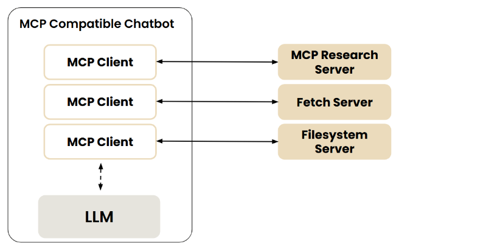
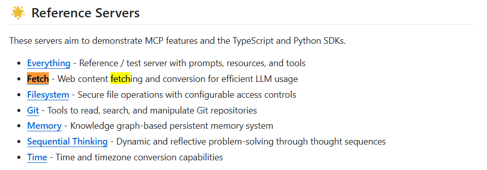
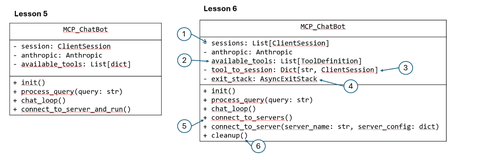
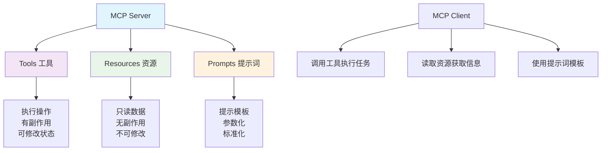

## MCP with more tools


## 背景：
通过上一章内容的介绍，大家已经学会如何使用MCP的PDK实现简单的 Client 和 Server。既然MCP很好的解决了不同LLM, 使用相同工具的问题，同时MCP协议的出现也很大程度上构建了很多可以复用的工具，因此这一章的内容，就是来教如何实现让LLM实现更多工具的调用，下面将逐步实现更多工具的调用。


架构图如下：





- [Model Context Protocol - Fetch Server](https://github.com/modelcontextprotocol/servers/tree/main/src/fetch "MCP官方的fetch服务器实现")

- [Model Context Protocol - Filesystem Server](https://github.com/modelcontextprotocol/servers/tree/main/src/filesystem) - MCP官方的文件系统服务器实现

通过这两个官方提供的MCP服务，我们可以在本地实现更为方便的文件抓取，和系统管理，在此之后我们将进一步挖掘如何通过组合这些MCP 工具让LLM实现非常复杂的工具调用和任务实现。


## 代码部分：
和之前的MCP Client 和 MCP Server的设计方法一样，首先我们需要配置 MCP 的配置文件，来告诉LLM有那些MCP服务可以使用。由于这次使用的是官方的 MCP 服务，为此只需要在配置文件中进行修改即可，


```json
{
    "mcpServer": {

        "filesystem": {
            "command": "npx",
            "args": [
                "-y", 
                "@modelcontextprotocol/servers-filesystem",
                "."
            ]
        },
        "research": {
            "command": "uv",
            "args": ["run", "research_server.py"]
        },

        "fetch": {
            "command": "uvx",
            "args": ["mcp-server-fetch"]
        }
    }
}
```


其余部分我们将修改Chatbox来适配这些新增加的改动，其具体新增的部分可以由这张表格来体现，



由图片可见，需要改动的部分有： 
- List[ClientSession]: 因为现在不仅仅存在一个Client 而是存在多个Client 需要进行连接，每个Client 对应一个Server服务。
- available_tools: 此时需要暴露所有Server拥有的工具。
- tool_to_session: 这个函数用于构建tool对Client Session的映射，这样当大模型想要调用某个工具的时候，便可以映射到对应的Session.
- exit_stack: 用于实现会话管理， 之前的版本我们使用 with 关键字进行的管理，这里我们仍然可以使用 with ，但由于具有多个 Server 因此需要
使用 nested with进行操作
- connect_to_server: 用于实现Server服务器连接，通过调用 connect_to_server
- cleanup: 这个方法用于释放资源，以确保和Server的连接终止的时候，释放资源。

首先我们导入相关的库：
```python
%%writefile mcp_project/mcp_chatbot.py

from dotenv import load_dotenv
from anthropic import Anthropic
from mcp import ClientSession, StdioServerParameters, types
from mcp.client.stdio import stdio_client
from typing import List, Dict, TypedDict
from contextlib import AsyncExitStack
import json
import asyncio

load_dotenv()

class ToolDefinition(TypedDict):
    name: str
    description: str
    input_schema: dict

```

然后开始构建之前的 Chatbox, 首先我们需要定义初始化之前介绍的方法。

```python
class MCP_ChatBot:

    def __init__(self):
        # Initialize session and client objects
        self.sessions: List[ClientSession] = [] # new
        self.exit_stack = AsyncExitStack() # new
        self.anthropic = Anthropic()
        self.available_tools: List[ToolDefinition] = [] # new
        self.tool_to_session: Dict[str, ClientSession] = {} # new
```

然后我们设计可以连接单个服务器的方法。这个方法可以通过AsyncExitStack 来管理会话连接，同时建立了 List[ToolDefination] 以及
tool_to_session的工具名和ClientSession的字典映射关系。
```python
    async def connect_to_server(self, server_name: str, server_config: dict) -> None:
        """Connect to a single MCP server."""
        try:
            server_params = StdioServerParameters(**server_config)
            stdio_transport = await self.exit_stack.enter_async_context(
                stdio_client(server_params)
            ) # new
            read, write = stdio_transport
            session = await self.exit_stack.enter_async_context(
                ClientSession(read, write)
            ) # new
            await session.initialize()
            self.sessions.append(session)
            
            # List available tools for this session
            response = await session.list_tools()
            tools = response.tools
            print(f"\nConnected to {server_name} with tools:", [t.name for t in tools])
            
            for tool in tools: # new
                self.tool_to_session[tool.name] = session
                self.available_tools.append({
                    "name": tool.name,
                    "description": tool.description,
                    "input_schema": tool.inputSchema
                })
        except Exception as e:
            print(f"Failed to connect to {server_name}: {e}")
```

然后通过循环，建立和每个Server的连接。
```python
    async def connect_to_servers(self): # new
        """Connect to all configured MCP servers."""
        try:
            with open("server_config.json", "r") as file:
                data = json.load(file)
            
            servers = data.get("mcpServers", {})
            
            for server_name, server_config in servers.items():
                await self.connect_to_server(server_name, server_config)
        except Exception as e:
            print(f"Error loading server configuration: {e}")
            raise
```

然后便是处理请求和构建对话循环，和之前设计的CS架构保持一致。
```python
    async def process_query(self, query):
        messages = [{'role':'user', 'content':query}]
        response = self.anthropic.messages.create(max_tokens = 2024,
                                      model = 'claude-3-7-sonnet-20250219', 
                                      tools = self.available_tools,
                                      messages = messages)
        process_query = True
        while process_query:
            assistant_content = []
            for content in response.content:
                if content.type =='text':
                    print(content.text)
                    assistant_content.append(content)
                    if(len(response.content) == 1):
                        process_query= False
                elif content.type == 'tool_use':
                    assistant_content.append(content)
                    messages.append({'role':'assistant', 'content':assistant_content})
                    tool_id = content.id
                    tool_args = content.input
                    tool_name = content.name
                    
    
                    print(f"Calling tool {tool_name} with args {tool_args}")
                    
                    # Call a tool
                    session = self.tool_to_session[tool_name] # new
                    result = await session.call_tool(tool_name, arguments=tool_args)
                    messages.append({"role": "user", 
                                      "content": [
                                          {
                                              "type": "tool_result",
                                              "tool_use_id":tool_id,
                                              "content": result.content
                                          }
                                      ]
                                    })
                    response = self.anthropic.messages.create(max_tokens = 2024,
                                      model = 'claude-3-7-sonnet-20250219', 
                                      tools = self.available_tools,
                                      messages = messages) 
                    
                    if(len(response.content) == 1 and response.content[0].type == "text"):
                        print(response.content[0].text)
                        process_query= False

    
    
    async def chat_loop(self):
        """Run an interactive chat loop"""
        print("\nMCP Chatbot Started!")
        print("Type your queries or 'quit' to exit.")
        
        while True:
            try:
                query = input("\nQuery: ").strip()
        
                if query.lower() == 'quit':
                    break
                    
                await self.process_query(query)
                print("\n")
                    
            except Exception as e:
                print(f"\nError: {str(e)}")
```


然后设计cleanup（）函数：

```python
    async def cleanup(self): # new
        """Cleanly close all resources using AsyncExitStack."""
        await self.exit_stack.aclose()
```

最后便是构建主循环，实现能够连接3个MCP Server服务的chatbox


### Adding Prompt & Resource Features


这里我们将介绍 MCP Server 如何向 Client 暴露资源 resource 和 提示词模板 prompt。

首先我们介绍 Resource 它是一种只读的资源，同时有点类似与REST API 中的 GET端点，只提供数据，不会执行复杂的计算操作，同时不会改变系统的状态。
这里我们设计了两个资源

1. 资源 1：文件夹列表

```text
papers://folders
```

功能：列出论文目录中的所有可用文件夹
类比：就像查看电脑文件夹中有哪些子文件夹

2. 资源 2：特定主题的论文内容
```text
papers://topic/[主题名]
```
- 功能：获取某个特定主题的论文信息
- 类比：就像打开一个特定文件夹查看里面的文件内容

这里使用URI的方式表示资源，有点类似与网址和文件地址，用来标记资源。

然后我们便可以开始设计MCP的资源 :
```python
@mcp.resource("papers://folders")
def get_available_folders() -> str:
    """
    List all available topic folders in the papers directory.
    
    This resource provides a simple list of all available topic folders.
    """
    folders = []
    
    # Get all topic directories
    if os.path.exists(PAPER_DIR):
        for topic_dir in os.listdir(PAPER_DIR):
            topic_path = os.path.join(PAPER_DIR, topic_dir)
            if os.path.isdir(topic_path):
                papers_file = os.path.join(topic_path, "papers_info.json")
                if os.path.exists(papers_file):
                    folders.append(topic_dir)
    
    # Create a simple markdown list
    content = "# Available Topics\n\n"
    if folders:
        for folder in folders:
            content += f"- {folder}\n"
        content += f"\nUse @{folder} to access papers in that topic.\n"
    else:
        content += "No topics found.\n"
    
    return content

@mcp.resource("papers://{topic}")
def get_topic_papers(topic: str) -> str:
    """
    Get detailed information about papers on a specific topic.
    
    Args:
        topic: The research topic to retrieve papers for
    """
    topic_dir = topic.lower().replace(" ", "_")
    papers_file = os.path.join(PAPER_DIR, topic_dir, "papers_info.json")
    
    if not os.path.exists(papers_file):
        return f"# No papers found for topic: {topic}\n\nTry searching for papers on this topic first."
    
    try:
        with open(papers_file, 'r') as f:
            papers_data = json.load(f)
        
        # Create markdown content with paper details
        content = f"# Papers on {topic.replace('_', ' ').title()}\n\n"
        content += f"Total papers: {len(papers_data)}\n\n"
        
        for paper_id, paper_info in papers_data.items():
            content += f"## {paper_info['title']}\n"
            content += f"- **Paper ID**: {paper_id}\n"
            content += f"- **Authors**: {', '.join(paper_info['authors'])}\n"
            content += f"- **Published**: {paper_info['published']}\n"
            content += f"- **PDF URL**: [{paper_info['pdf_url']}]({paper_info['pdf_url']})\n\n"
            content += f"### Summary\n{paper_info['summary'][:500]}...\n\n"
            content += "---\n\n"
        
        return content
    except json.JSONDecodeError:
        return f"# Error reading papers data for {topic}\n\nThe papers data file is corrupted."
```

设计提示词模板，用于更准确的描述功能。

```python
@mcp.prompt()
def generate_search_prompt(topic: str, num_papers: int = 5) -> str:
    """Generate a prompt for Claude to find and discuss academic papers on a specific topic."""
    return f"""Search for {num_papers} academic papers about '{topic}' using the search_papers tool. Follow these instructions:
    1. First, search for papers using search_papers(topic='{topic}', max_results={num_papers})
    2. For each paper found, extract and organize the following information:
       - Paper title
       - Authors
       - Publication date
       - Brief summary of the key findings
       - Main contributions or innovations
       - Methodologies used
       - Relevance to the topic '{topic}'
    
    3. Provide a comprehensive summary that includes:
       - Overview of the current state of research in '{topic}'
       - Common themes and trends across the papers
       - Key research gaps or areas for future investigation
       - Most impactful or influential papers in this area
    
    4. Organize your findings in a clear, structured format with headings and bullet points for easy readability.
    
    Please present both detailed information about each paper and a high-level synthesis of the research landscape in {topic}."""

```

其具体的工作流程可以，非常容易的根据下面的图片进行理解：


---

## 📋 MCP Server 功能暴露机制总结

MCP (Model Context Protocol) 通过多种机制让 Server 向 Client 暴露不同类型的功能，每种功能都有其特定的用途和限制。

### 🔧 功能类型对比

#### **传统功能：Tools（工具）**
- ✅ **可以执行操作**：如搜索、下载、文件操作等
- ✅ **有副作用**：可以改变系统状态
- ✅ **支持复杂计算**：可以执行耗时或复杂的操作
- 📝 **示例**：`search_papers()`, `download_file()`, `create_directory()`

#### **新增功能 1：Resources（资源）**
- ✅ **只能读取数据**：提供现有信息的访问
- ❌ **不能修改任何内容**：严格的只读限制
- ❌ **不能执行复杂计算**：类似 REST API 的 GET 端点
- 🔗 **URI 标识**：每个资源都有唯一的 URI 标识符
- 📝 **示例**：
  - `papers://folders` - 查看文件夹列表  
  - `papers://topic/{topic}` - 读取特定主题的论文信息

#### **新增功能 2：Prompts（提示词模板）**
- ✅ **提供预设的提示词模板**：经过优化的提示词
- ✅ **用户只需填入参数**：简化用户操作
- ❌ **无需复杂提示词工程**：降低用户门槛
- 🎯 **参数化设计**：支持动态参数替换
- 📝 **示例**：`generate_search_prompt(topic, num_papers)`

### 🏗️ 整体架构设计



### 🎯 使用场景对比

| 功能类型 | 使用场景 | 特点 | 限制 |
|---------|---------|------|-----|
| **Tools** | 执行搜索、下载文件、创建目录 | 可执行操作，有副作用 | 执行成本较高 |
| **Resources** | 查看文件列表、读取配置信息 | 快速获取现有数据 | 只读，无法修改 |
| **Prompts** | 标准化查询、模板化操作 | 降低提示词工程复杂度 | 仅提供模板 |


通过这种多层次的功能暴露机制，MCP 协议实现了更加丰富、安全和高效的 Client-Server 交互模式。


