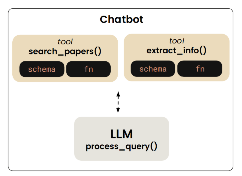

## AGENT 调用工具快速入门： 通过Anthropic快速构建可以调用工具的chatbox


## 前情提要：
    阅读时间预估15分钟-30分钟，涉及了如何获取Anthropic api 以及 如何构可以进行function call的agent，这里以一个可以查阅arxiv论文的chatbox。

## 架构设计以及流程图：


    tools design


## 0. 准备阶段：
```python
import arxiv
import json
import os
from typing import List
from dotenv import load_dotenv
import anthropic
```

## 1. Tools design

- 论文信息搜索工具设计：
这里我们希望构建两个工具，第一个工具是 search_papers 用于实现利用arxiv客户端，通过关键词搜索对应的论文，其中我们会限定搜索的的最大数量，作为一个参数。因此其输入值为论文主题 <topic> ，和最大搜索数量 <max_results>, 最终返回包括前五个论文信息字典，组成的列表， List[arxiv.Result]，同时会将搜索到的信息存储在本地的papers文件夹中。
```python
def search_papers(topic: str, max_results: int = 5) -> List[arxiv.Result]:
    """
    Search for papers on arXiv based on a topic and store their information.
    
    Args:
        topic: The topic to search for
        max_results: Maximum number of results to retrieve (default: 5)
        
    Returns:
        List of paper IDs found in the search
    """

    # Use arxiv to find the papers
    client = arxiv.Client()

    # Search for the most relevant articles matching the queried topic
    search = arxiv.Search(
        query=topic,
        max_results=max_results,
        sort_by=arxiv.SortCriterion.Relevance
    )

    papers = client.results(search)

    # Create directory for this topic
    path = os.path.join(PAPER_DIR, topic.lower().replace(" ", "_"))
    os.makedirs(path, exist_ok=True)

    file_path = os.path.join(path, "papers_info.json")

    # Try to load existing papers info
    try:
        with open(file_path, "r") as json_file:
            papers_info = json.load(json_file)
    except (FileNotFoundError, json.JSONDecodeError):
        papers_info = {}

    # Process each paper and add to papers_info  
    paper_ids = []
    for paper in papers:
        paper_ids.append(paper.get_short_id())
        paper_info = {
            'title': paper.title,
            'authors': [author.name for author in paper.authors],
            'summary': paper.summary,
            'pdf_url': paper.pdf_url,
            'published': str(paper.published.date())
        }
        papers_info[paper.get_short_id()] = paper_info

    # Save updated papers_info to json file
    with open(file_path, "w") as json_file:
        json.dump(papers_info, json_file, indent=2)
    
    print(f"Results are saved in: {file_path}")
    print(paper_ids)
    return paper_ids
```

    
- 信息提取工具设计：
这个工具用于根据paper_id，在本地的论文信息中进行检索，然后输出对应的论文信息字典。
```python
def extract_info(paper_id: str) -> str:
    """
    Search for information about a specific paper across all topic directories.
    
    Args:
        paper_id: The ID of the paper to look for
        
    Returns:
        JSON string with paper information if found, error message if not found
    """
 
    for item in os.listdir(PAPER_DIR):
        item_path = os.path.join(PAPER_DIR, item)
        if os.path.isdir(item_path):
            file_path = os.path.join(item_path, "papers_info.json")
            if os.path.isfile(file_path):
                try:
                    with open(file_path, "r") as json_file:
                        papers_info = json.load(json_file)
                        if paper_id in papers_info:
                            return json.dumps(papers_info[paper_id], indent=2)
                except (FileNotFoundError, json.JSONDecodeError) as e:
                    print(f"Error reading {file_path}: {str(e)}")
                    continue
    
    return f"There's no saved information related to paper {paper_id}."
```

说是工具本质上便是简单的函数设计，核心是教会LLM如何主动的根据和用户的对话来调用工具，这样便极大的提升了LLM可以处理事件的范围。


## 2. 编写LLM工具调用格式说明：

虽然我们设计了两个工具让LLM进行调用，但是当前状态下LLM并不知道这两个工具的存在，因此我们需要填写LLM的tools参数，以"告知" LLM这里有两个工具你可以用。告诉他的方法非常简单，就是编写一个由字典组成的列表，每个字典包含了对一个工具的介绍，其具体格式如下：

```python
# build the tool imformation to tell te LLM there are two tools available
tools = [
    {
        "name" : "search_papers",
        "description" : "Search for papers on arXiv based on a topic and store their information.",
        "input_schema" : {
            "type" : "object",
            "properties" : {
                "topic" : {
                    "type" : "string",
                    "description" : "The topic to search for"
                },
                "max_results" : {
                    "type" : "integer",
                    "description" : "The maximum number of results to retrieve (default: 5)",
                    "default" : 5
                }
            },
            "required" : ["topic"]
        }
    },
    {
        "name" : "extract_info",
        "description" : "Search for information about a specific paper across all topic directories.",
        "input_schema" : {
            "type" : "object",
            "properties" : {
                "paper_id" : {
                    "type" : "string",
                    "description" : "The ID of the paper to extract information from"
                }
            },
            "required" : ["paper_id"]
        }
    }
]
```

## 3. 构建一个工具选择字典，同时定义执行工具函数，

    其主要的目的是为了便于后续工作流的控制，这样便可以实现对工具的选择调用

```python
# this code handles tool mapping and execution
# 构建了一个字典，用于选择工具。
mapping_tool_function = {
    "search_papers" : search_papers,
    "extract_info" : extract_info
}
def execute_tool(tool_name: str, tool_args):

    result = mapping_tool_function[tool_name](**tool_args)

    if result is None:
        result = "The operation completed but didn't return any results."
        
    elif isinstance(result, list):
        result = ', '.join(result)
        
    elif isinstance(result, dict):
        # Convert dictionaries to formatted JSON strings
        result = json.dumps(result, indent=2)
    
    else:
        # For any other type, convert using str()
        result = str(result)
    return result
```

## 4. 定义智能体，以及执行流程

```python
load_dotenv()
client = anthropic.Anthropic()

# doing query processing
# 进行问题键的处理：
def process_query(query: str):

    messages = [{"role": "user", "content": query}]

    response = client.messages.create(max_tokens = 2024,
                                      model = "claude-3-7-sonnet-20240229",
                                      messages = messages,
                                      tools = tools,
                                      tool_choice = "auto")
    
    process_query = True

    while process_query:

        assistant_content = []

        for content in response.content:
            if content.type == "text":
            
                print(content.text)
                assistant_content.append(content.text)

                # 此时response.content 只有一个元素，并且是文本，说明Claude给出了最终答案，因此是一个完整的响应
                if len(response.content) == 1:
                    process_query = False

            # the llm call the tool, need to continue the conversation
            # 此时包含了工具调用，因此继续进行对话
            elif content.type == "tool_use":

                assistant_content.append(content)
                messages.append({
                    "role" : "assistant",
                    "content" : assistant_content, 
                })

                tool_id = content.id
                tool_args = content.input
                tool_name = content.name
                print(f"Calling tool: {tool_name} with args {tool_args}")

                result = execute_tool(tool_name, tool_args)

                messages.append({
                    "role" : "user",
                    "content" : [
                        {
                            "type" : "tool_result",
                            "tool_use_id" : tool_id,
                            "content" : result
                        }
                    ],
                })

                response = client.messages.create(
                    max_tokens = 2024,
                    model = "claude-3-7-sonnet-20240229",
                    tools = tools,
                    messages = messages)
                
                if len(response.content) == 1 and response.content[0].type == "text":
                    print(response.content[0].text)
                    process_query = False
```


## 5. 构建问答循环：

    这样便可以实现问答了！
```python
def chat_loop():
    print("Type your queries or 'quit' to exit.")
    while True:
        try:
            query = input("\nQuery: ").strip()
            if query.lower() == 'quit':
                break
    
            process_query(query)
            print("\n")
        except Exception as e:
            print(f"\nError: {str(e)}")

```

## 6. main函数设计
```python
def main():
    search_papers("machine learning")
    print(extract_info("1811.04422v1"))
    chat_loop()
    

if __name__ == "__main__":
    main()
```