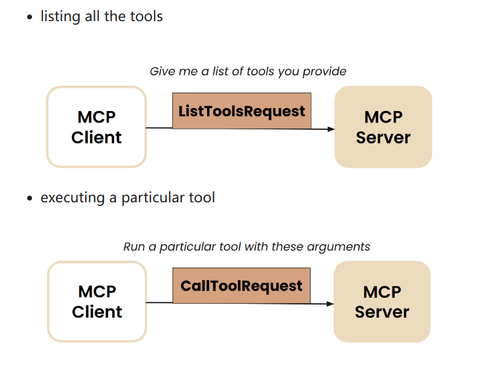

## 什么是MCP?
    MCP（Model Context Protocol）模型上下文协议。是一种大模型调用工具的通用协议。

## 为什么要使用MCP?
MCP的诞生非常自然，即和所有协议一样，如果我设计了一种工具符合厂商的大模型调用规范，那么如果我换了另外一个厂商是否意味着我需要重写这个工具呢？MCP便是诞生在这个思考之下，通过MCP这种协议，设计的工具能够被不同的大模型使用，而无需通过厂商设定的调用规范来实现。MCP优秀的地方在于其折中的设计，在控制设计复杂度的同时兼顾了性能和实用性。

## MCP Architecture:
下面我们便首先来介绍一下MCP的整体设计架构。

## MCP Server
（总）：为了便于理解我们使用最简单的stdio（"Standard Input/Output"）协议，来进行MCP Client和 MCP Server之间的通信，使用stdio的原因是，因为它不需要复杂的网路配置，也不需要进行端口的管理，可以直接通过进程的标准化输入输出进行通信。
    
- MCP Server的设计主要可以分解为一下几步：

为了避免过多的细节，我们使用  <FastMCP> 包来快速实现 MCP Server
    （分）：

## MCP Client
    （总）：

    （分）：