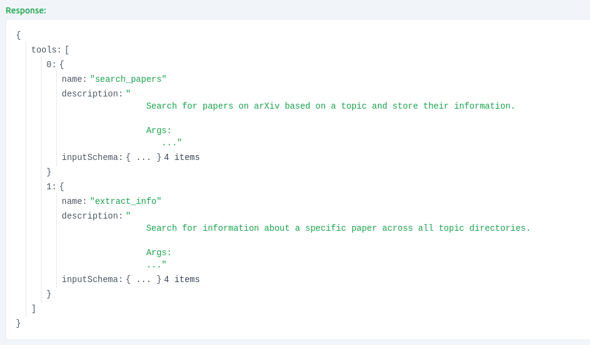
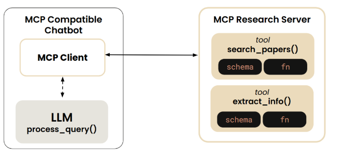

- 需要的前置知识：
    （1）uv 的简单使用 （2）：一些基础的前后端知识 （3）python语言的基本掌握

## 什么是MCP?
    MCP（Model Context Protocol）模型上下文协议。是一种大模型调用工具的通用协议。

## 为什么要使用MCP?
MCP的诞生非常自然，即和所有协议一样，如果我设计了一种工具符合厂商的大模型调用规范，那么如果我换了另外一个厂商是否意味着我需要重写这个工具呢？MCP便是诞生在这个思考之下，通过MCP这种协议，设计的工具能够被不同的大模型使用，而无需通过厂商设定的调用规范来实现。MCP优秀的地方在于其折中的设计，在控制设计复杂度的同时兼顾了性能和实用性。

## MCP Architecture:
下面我们便首先来介绍一下MCP的整体设计架构。

## MCP Server
（总）：为了便于理解我们使用最简单的stdio（"Standard Input/Output"）协议，来进行MCP Client和 MCP Server之间的通信，使用stdio的原因是，因为它不需要复杂的网路配置，也不需要进行端口的管理，可以直接通过进程的标准化输入输出进行通信。
    
- MCP Server的设计主要可以分解为一下几步：


MCP Server的实现可以分为两种方式，第一种是通过传统的前后端配合的低级实现，另一种是通过MCP 官方的PDK来实现，为了避免过多的细节，我们使用  <FastMCP> 包来快速实现 MCP Server

首先我们导入相关的环境依赖，可以使用uv安装相关的包。
```python
import arxiv
import json
import os
from typing import List
from mcp.server.fastmcp import FastMCP
PAPER_DIR = "papers"

# Initialize FastMCP server
mcp = FastMCP("research")
```

然后我们便可以利用官方提供的MCP 装饰函数来构建MCP工具:
这里借助在chatbox中实现的两个工具，利用装饰函数，来进行MCP工具的装饰。
```python
@mcp.tool()
def search_papers(topic: str, max_results: int = 5) -> List[str]:
    """
    Search for papers on arXiv based on a topic and store their information.
    
    Args:
        topic: The topic to search for
        max_results: Maximum number of results to retrieve (default: 5)
        
    Returns:
        List of paper IDs found in the search
    """
    
    # Use arxiv to find the papers 
    client = arxiv.Client()

    # Search for the most relevant articles matching the queried topic
    search = arxiv.Search(
        query = topic,
        max_results = max_results,
        sort_by = arxiv.SortCriterion.Relevance
    )

    papers = client.results(search)
    
    # Create directory for this topic
    path = os.path.join(PAPER_DIR, topic.lower().replace(" ", "_"))
    os.makedirs(path, exist_ok=True)
    
    file_path = os.path.join(path, "papers_info.json")

    # Try to load existing papers info
    try:
        with open(file_path, "r") as json_file:
            papers_info = json.load(json_file)
    except (FileNotFoundError, json.JSONDecodeError):
        papers_info = {}

    # Process each paper and add to papers_info  
    paper_ids = []
    for paper in papers:
        paper_ids.append(paper.get_short_id())
        paper_info = {
            'title': paper.title,
            'authors': [author.name for author in paper.authors],
            'summary': paper.summary,
            'pdf_url': paper.pdf_url,
            'published': str(paper.published.date())
        }
        papers_info[paper.get_short_id()] = paper_info
    
    # Save updated papers_info to json file
    with open(file_path, "w") as json_file:
        json.dump(papers_info, json_file, indent=2)
    
    print(f"Results are saved in: {file_path}")
    
    return paper_ids

@mcp.tool()
def extract_info(paper_id: str) -> str:
    """
    Search for information about a specific paper across all topic directories.
    
    Args:
        paper_id: The ID of the paper to look for
        
    Returns:
        JSON string with paper information if found, error message if not found
    """
 
    for item in os.listdir(PAPER_DIR):
        item_path = os.path.join(PAPER_DIR, item)
        if os.path.isdir(item_path):
            file_path = os.path.join(item_path, "papers_info.json")
            if os.path.isfile(file_path):
                try:
                    with open(file_path, "r") as json_file:
                        papers_info = json.load(json_file)
                        if paper_id in papers_info:
                            return json.dumps(papers_info[paper_id], indent=2)
                except (FileNotFoundError, json.JSONDecodeError) as e:
                    print(f"Error reading {file_path}: {str(e)}")
                    continue
    
    return f"There's no saved information related to paper {paper_id}."
```

最后在主函数中编写mcp.run()，用于告诉mcp使用<stdio>协议进行通讯：
```python
if __name__ == "__main__":
    # Initialize and run the server
    mcp.run(transport='stdio')
```


为了能够运行mcp inspector我们需要下载一下node.js和一些插件


### 首先我们需要安装相关依赖
```bash
sudo apt update && sudo apt install nodejs npm -y
```


### 
```bash
# 设定client 和 Server 的端口
CLIENT_PORT=8080 SERVER_PORT=9000 npx @modelcontextprotocol/inspector mcp_project/research_server.py
```



## MCP Client

通常MCP Client会是一个chatbox,不用自己来写，但是为了让大家更加了解 MCP 协议发生了什么，我们可以实现一遍client以更好的进行理解
MCP协议的具体实现方式。这里我们可以参考之前chatbox处理问答的实现，唯一的区别在与工具和资源的调用已经被封装到了 MCP Server中，


因此我们需要通过mcp库对原来的chatbox进行封装, 构建MCP chatbox，他将包含3个主要的方法：
- process_query
- chat loop
- connect_to_server_and_run

其中，process_query用于处理和用户的对话，chatloop用于构建对话循环，而connect_to_server_and_run用于实现和mcp server建立连接。


首先我们需要导入相关MCP的库：
```python
## writefile mcp_project/mcp_chatbot.py
from mcp import ClientSession, StdioServerParameters, types
from mcp.client.stdio import stdio_client
```

然后我们需要通过定义 server_params 来告诉client如何与server建立连接：
```python
server_params = StdioServerParmeters{
    command="uv" # Excutable
    args=["run", "reaearch_server.py"] # Optional command line arguments
    env=None # Optional environment variables
}
```

然后我们便开始构建 <MCP_Chatbox>类

```python
class MCP_ChatBot:

    def __init__(self):
        # Initialize session and client objects
        self.session: ClientSession = None
        self.anthropic = Anthropic()
        self.available_tools: List[dict] = []

    async def process_query(self, query):
        message = [{'role': 'user', 'content': query}]
        response = self.anthropic.message.create(
            max_tokens = 2024.
            model = 'claude-3-7-sonnet-20250219'
            tools = self.available_tools,
            messages = messages
        )
        process_query = True
        while process_query:
            asistent_content = []
            for content in response.content:
                if content.type == 'text':
                    print(content.text)
                    assistant_content.append(content)
                    if len(response.content == 1): # 标着这对话已经结束，可以退出
                        process_query = False 

                if content.type == 'tool_use'
                    assistant_content.append(content)
                    messages.append({
                        'role': 'assistant',
                        'content': assistant_content
                    })
                    tool_id = content.id
                    tool_args = content.input
                    tool_name = content.name

                    print(f"Calling tool {tool_name} with args {tool_args}")

                    # call a tool 
                    #result = execute_tool(tool_name, tool_arge): not any more needed
                    # tool inovation trough the client session

                    result = await self.session.call_tool(tool_name, arguments= tool_args)
                    message.append("role": "user",
                                    "content":[
                                        {
                                        "type": "tool_resutl".
                                        "tool_use_id": tool_id,
                                        "content": result.content
                                        }
                                    ]
                                )
                    response = self.anthropic.messages.create(max_tokens = 2024,
                                      model = 'claude-3-7-sonnet-20250219', 
                                      tools = self.available_tools,
                                      messages = messages) 


                    if(len(response.content) == 1 and response.content[0].type == "text"):
                        print(response.content[0].text)
                        process_query= False

    async def chat_loop(self):
        """Run an interactive chat loop"""
        print("\nMCP Chatbot Started!")
        print("Type your queries or 'quit' to exit.")
        
        while True:
            try:
                query = input("\nQuery: ").strip()
        
                if query.lower() == 'quit':
                    break
                    
                await self.process_query(query)
                print("\n")
                    
            except Exception as e:
                print(f"\nError: {str(e)}")
    
    
    async def connect_to_server_and_run(self):

        """
        (1): 整体流程总结：
        (2): 配置服务器连接参数
        (3): 建立 stdio 连接
        (4): 创建 MCP 会话
        (5): 初始化协议连接
        (6): 获取并保存可用工具
        (7): 启动用户交互循环
        """
        # Create server parameters for stdio connection
        server_params = StdioServerParameters(
            command="uv",  # Executable
            args=["run", "research_server.py"],  # Optional command line arguments
            env=None,  # Optional environment variables
        )
        async with stdio_client(server_params) as (read, write):
            async with ClientSession(read, write) as session:
                self.session = session
                # Initialize the connection
                await session.initialize()
    
                # List available tools
                response = await session.list_tools()
                
                tools = response.tools
                print("\nConnected to server with tools:", [tool.name for tool in tools])
                
                self.available_tools = [{
                    "name": tool.name,
                    "description": tool.description,
                    "input_schema": tool.inputSchema
                } for tool in response.tools]
    
                await self.chat_loop()


        async with 

async def main():
    chat_box = MCP_Chatbot()
    await chatbot.connect_to_server_and_run()


if __name__ == "__main__":
    asyncio.run(main())
```